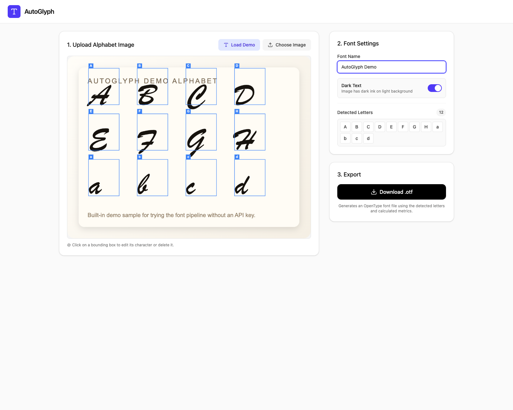
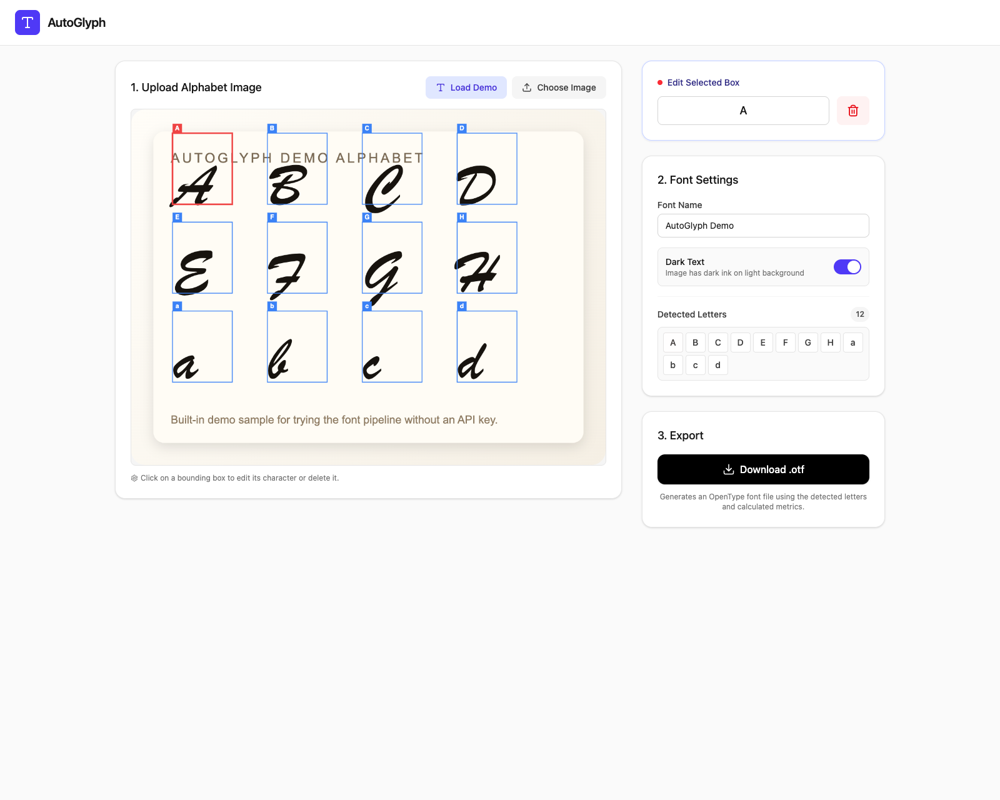
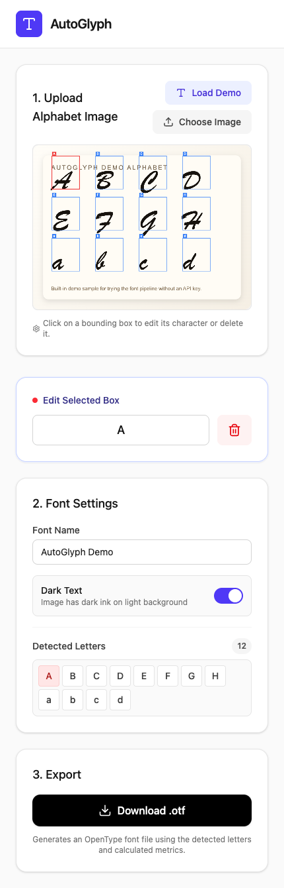

<div align="center">
  

  # AutoGlyph

  **Turn a photographed alphabet sheet into a real OpenType font in minutes.**

  Upload handwriting or printed letters, detect glyph regions with Gemini, correct anything by hand, and export a working `.otf` file without leaving the browser.

  <p>
    
    
    
    
  </p>
</div>

## Why It Feels Good

Most font-generation tools are either too technical, too manual, or too opaque. AutoGlyph keeps the loop tight:

- Drop in an alphabet sheet.
- Let Gemini propose letter boxes.
- Click any box to fix the character mapping.
- Export a usable OpenType font.

That makes it fast enough for experimentation and explicit enough to trust.

## Screenshots

<p align="center">
  
</p>

<p align="center">
  
</p>

<p align="center">
  
</p>

## What It Does

- Uploads an image of handwritten or printed alphabet characters.
- Detects candidate glyph boxes from the image with Gemini.
- Draws every detected region directly on the source image.
- Lets you click a region, relabel it, or delete it.
- Converts image crops into vector glyph paths.
- Exports the result as an OpenType font file.
- Includes a built-in demo so the full editing/export flow works even without an API key.

## How It Works

1. **Load an image**
   Use your own alphabet sheet or the built-in demo sample.

2. **Detect letters**
   Gemini analyzes the image and returns normalized bounding boxes for each detected character.

3. **Clean up the mapping**
   Click any box to edit the assigned character or remove a bad detection.

4. **Tune the font**
   Set a font name and choose whether the source image uses dark ink on a light background.

5. **Export**
   AutoGlyph traces each crop into vector outlines and downloads an `.otf` font.

## Try It In 60 Seconds

### 1. Install

```bash
npm install
```

### 2. Run locally

```bash
npm run server
npm run dev
```

Open `http://localhost:3000`.

### 3. Use the built-in demo

Click `Load Demo` and export a font immediately.

### 4. Turn on AI detection

Create a local env file and add your Gemini key:

```bash
cp .env.example .env.local
```

Set:

```bash
GEMINI_API_KEY=your_key_here
```

Then run the server process and use `Detect with Gemini` when you want AI-assisted boxing.

## Best Results

- Put one character per region with generous spacing.
- Use a high-contrast sheet.
- Keep the page roughly flat and evenly lit.
- Review detections before exporting.
- Include ascenders and descenders clearly for lowercase letters.

## Tech Stack

- `React 19` + `Vite`
- `Tailwind CSS v4`
- `@google/genai` for image-to-box detection
- `d3-contour` for outline extraction
- `opentype.js` for font assembly and download

## Notable Details

- Detection results use normalized `[ymin, xmin, ymax, xmax]` coordinates.
- Export currently produces an OpenType font file.
- Glyph sizing uses character-specific metric heuristics so uppercase, x-height, ascenders, and descenders land in more believable vertical positions.
- The demo path is bundled into the app so screenshots, testing, and first-run experience do not depend on external secrets.

## Current Limits

- Detection quality depends heavily on the uploaded sheet.
- Kerning and advanced font metadata are intentionally minimal.
- The generated font is best for experiments, prototypes, and expressive custom sets rather than production typography.

## Project Structure

```text
src/
  App.tsx                Main UI and interaction flow
  demoAlphabet.ts        Built-in demo sample metadata
  utils/
    gemini.ts            Image-to-letter detection via Gemini
    fontGenerator.ts     Raster crop to vector glyph export
public/
  demo-alphabet.svg      Bundled demo source image
docs/images/             README screenshots
```

## Development

```bash
npm run lint
npm run build
```

## Quick Deploy To Your FTP Server

This project now supports a deliberately simple personal-server deploy flow.

1. Create a deploy env file:

```bash
cp .env.deploy.example .env.deploy.local
```

2. Put your FTP credentials in `.env.deploy.local`.

3. Build and upload the site:

```bash
npm run build
npm run deploy
```

Notes:

- The deploy script uploads the contents of `dist/` to `public_html` by default.
- `.env.deploy.local` stays gitignored via `.env*`, so your FTP password should not be committed.
- FTPS is used by default (`FTP_SECURE=true`). If the host only accepts plain FTP, set `FTP_SECURE=false`.
- The remote target can be changed with `FTP_REMOTE_DIR`.

### Gemini on PHP hosting

If your hosting account supports PHP, this repo now includes `public/api/detect-letters.php`.

To enable Gemini detection in production:

1. The deploy script uploads `public/api/detect-letters.php` into `public_html/api/`
2. Put `GEMINI_API_KEY=your_key_here` in a server-side `.env.local` file at the project root on the host
3. Confirm PHP has cURL enabled

The frontend now calls `/api/detect-letters.php` in production.

## The Pitch

AutoGlyph is a small, sharp tool for a very satisfying workflow: take a physical alphabet, map it quickly, and leave with a font file.

It is part creative toy, part practical utility, and now it has a README worthy of the thing itself.
